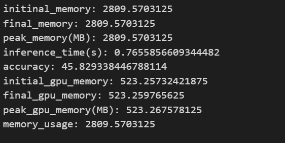

# 大模型部署试题报告

## 1.实验任务
- 本地部署开源LLM进行性能测试——以DistilBERT-base-cased为例
- 收集性能测试数据并生成CSV文件存储实验结果
- 对实验测试结果进行可视化处理

## 2.实验环境
- WSL2 Ubuntu20.04LTS
- Anaconda 24.1.2
- Python3.10
- cuda12.0； torch11.8；NVIDIA Geforce RTX 3060 Laptop GPU
- vscode 1.91.0


## 3.实验流程
#### a.部署DistilBERT
$\qquad$Huggingface是一个知名的开源大模型共享平台，利用huggingface提供的库，我们可以方便地调用大多数开源LLM。

$\qquad$为了方便进行实验，我们将LLM下载到本地进行部署,本次实验选取的LLM为DistilBERT base uncased finetuned SST-2
```shell
git lfs install
git lfs clone git@hf.co:distilbert/distilbert-base-uncased-finetuned-sst-2-english
```

接下来利用Anaconda创建conda环境，配置相关库即可
```shell
conda create -n your_env_name python=3.10
conda activate your_env_name
pip install -r requirements.txt
```
注：本目录下附带的requirements.txt较为繁杂，请根据需求自行选择库安装，LLM的使用需要用到transformers库，具体的使用方法在此不进行赘述

#### b.选取数据集并进行测试

模型评估的流程为：构建数据集---冻结模型参数并对数据集进行预测---构建评估方法比对结果

性能测试需要我们对评估过程的时间、内存使用情况和准确率进行存储和可视化：

对于时间的测量，只需要使用time库从评估开始进行计时，评估结束后停止计时，即可获得。

对于内存使用情况的测量，需要用到psutil库，通过psutil.Process().memory_info().
rss 追踪当前内存情况，单位是Byte，转换为MB需要除以1024*1024，由于这一部分我知之甚少，因此关于内存使用情况的测量部分是在GPT-4的协助下完成的。

至于任务的准确率，只需要根据模型的预测结果与数据集本身的labels进行比对，计算预测正确的占比即可。

##### 任务：情感分析
选取数据集SST2，用于情感分析测试，其中数据集$label=\{'0':negative;'1':positive;'-1':no label\}^{n}$，每一条数据由idx、sentence和label组成
```shell
git lfs install
git lfs clone git@hf.co:datasets/stanfordnlp/sst2
```

我们使用torch.utils.data中的Dataset类构建自己的Dataset，读取并观察数据集：


官方给定评估结果：


加载SST2数据集的验证集进行推理（此处过程不在报告中赘述，详情见代码），结果如下：

加载训练集进行推理，结果如下：

此处使用psutil库进行内存追踪，记录memory_usage为峰值的内存使用情况,此外我们还对GPU显存使用情况进行了追踪


##### 任务：语言学分类（判断句子是否属于符合英语语法的句子）

采用数据集CoLA的验证集进行评估，由于CoLA数据集的字典key和SST2一样，因此我们可以对之前的代码基本不做改动，结果如下：



#### c.可视化存储结果


## 4.总结

$\qquad$本次实验是大模型的部署练习，完成此任务需要对Pytorch相关库、huggingface系列的库有一定的了解，同时还要对Python有一定的掌握，对于低年级本科生来说具有一定的难度 ~~（大概）~~ 因为我已经有一定的基础了，因此报告可能会写的不是特别详细，在完成工作的过程中也几乎没有碰到太多问题，因此我在这一部分就谈一谈我对自己的项目的反思和我学习的一些经验。

**首先是对项目的反思。**
**其一**，评测过程偷懒了QAQ，评测的任务非常少；
**其二**，自己对huggingface相关库的了解也不是特别深，在加载数据集的过程中完全可以使用datasets里的load_dataset()完成，无需手写自定义数据集类，可以大幅减少代码量，而且自己的自定义数据集类写的也较为简陋，tokenizer等可以直接加进去；
~~其三，能够改进的地方有点多自己一时看不过来了~~

**下面是学习经验**
关于我自己的学习经验的话，这里篇幅过小可能写不下，只能提供一些学习资料的网址了：
https://www.cnblogs.com/ranxi169/p/16721324.html
https://transformers.run/
https://datawhalechina.github.io/thorough-pytorch/index.html
以及huggingface的官方教程和pytorch的官方文档


## 5.附录
源码文件eval_model.ipynb
```python
import torch
from torch.utils.data import Dataset
import pandas as pd


sst_train = "./sst2/data/train-00000-of-00001.parquet"
sst_val = "./sst2/data/validation-00000-of-00001.parquet"
sst_test = "./sst2/data/test-00000-of-00001.parquet"

cola_val = './glue/cola/validation-00000-of-00001.parquet'


class SST2(Dataset):
    def __init__(self, data_file):
        self.data = self.load_data(data_file)
    
    def load_data(self, data_file):
        Data = []
        data1 = pd.read_parquet(data_file)
        for i in range(len(data1['idx'])):
            Data.append(data1.loc[i].to_dict())
        return Data
    
    def __len__(self):
        return len(self.data)

    def __getitem__(self, idx):
        return self.data[idx]


class COLA(Dataset):
    def __init__(self, data_file):
        self.data = self.load_data(data_file)
    
    def load_data(self, data_file):
        Data = []
        data1 = pd.read_parquet(data_file)
        for i in range(len(data1['idx'])):
            Data.append(data1.loc[i].to_dict())
        return Data
    
    def __len__(self):
        return len(self.data)

    def __getitem__(self, idx):
        return self.data[idx]


SST_train_data = SST2(sst_train)
SST_val_data = SST2(sst_val)
SST_test_data = SST2(sst_test)

print("train_dataset: %s"%SST_train_data[0])
print(len(SST_train_data))
print("val_dataset: %s"%SST_val_data[0])
print(len(SST_val_data))
print("test_dataset: %s"%SST_test_data[0])


cola_val_data = COLA(cola_val)
print(cola_val_data[0])


from transformers import DistilBertTokenizer, DistilBertForSequenceClassification
from torch.utils.data import DataLoader
import torch.nn as nn
import csv
import time
import psutil
import os


def collate_fn(batch):
    prompts = [item['sentence'] for item in batch]
    labels = [item['label'] for item in batch]
    encodings = tokenizer(prompts, padding=True, truncation=True, max_length=512, return_tensors='pt')
    encodings['labels'] = torch.tensor(labels)
    return encodings


def evaluate(model, dataloader):
    model.eval()
    correct = 0
    total = 0
    start_time = time.time()  
    initial_memory = psutil.Process().memory_info().rss / (1024 * 1024)  # 初始内存使用
    print("initinal_memory: %s"%initial_memory)
    process = psutil.Process(os.getpid())  # 获取当前进程
    peak_memory_usage = 0
    peak_gpu_memory = 0
    initial_gpu = torch.cuda.memory_allocated()

    with torch.no_grad():
        for batch in dataloader:
            input_ids = batch['input_ids'].to(device)
            attention_mask = batch['attention_mask'].to(device)
            labels = batch['labels'].to(device)
            outputs = model(input_ids, attention_mask=attention_mask)
            predictions = torch.argmax(outputs.logits, dim=-1)
            # print(predictions)
            # print(labels)
            correct += (predictions == labels).sum().item()
            total += labels.size(0)

             # 更新内存峰值
            memory_info = process.memory_info()
            peak_memory_usage = max(peak_memory_usage, memory_info.rss)

            gpu_info = torch.cuda.memory_allocated()
            peak_gpu_memory = max(peak_gpu_memory,gpu_info)
    
    end_time = time.time()  
    final_memory = psutil.Process().memory_info().rss / (1024 * 1024)  
    final_gpu = torch.cuda.memory_allocated()
    inference_time = end_time - start_time
    accuracy = (100*correct) / total

    print("final_memory: %s"%final_memory)
    peak_memory_mb = peak_memory_usage / (1024*1024)
    print("peak_memory(MB): %s"%peak_memory_mb)
    print("inference_time(s): %s"%inference_time)
    print("accuracy: %s"%accuracy)
    print("initial_gpu_memory: %s"%(initial_gpu/(1024*1024)))
    print("final_gpu_memory: %s"%(final_gpu/(1024*1024)))
    print("peak_gpu_memory(MB): %s"%(peak_gpu_memory/(1024*1024)))
    memory_usage = peak_memory_mb
    print("memory_usage: %s"%memory_usage)
    return  accuracy, inference_time, memory_usage


# 文件路径
file_path = './model_performance.csv'

if os.path.isfile(file_path):
    pass
else:
    with open(file_path, mode='w', newline='') as file:
        writer = csv.writer(file)
        writer.writerow(['Dataset', 'Task', 'Inference Time (seconds)', 'Memory Usage (MB)', 'Accuracy (%)'])


# 模型配置
model_path = '/home/yang1210/Files/LLM/models/distilbert-base-uncased-finetuned-sst-2-english'
device = torch.device("cuda" if torch.cuda.is_available() else "cpu")

tokenizer = DistilBertTokenizer.from_pretrained(model_path,local_files_only=True)
model = DistilBertForSequenceClassification.from_pretrained(model_path)
model.to(device)

batch_size = 16
val_dataloader = DataLoader(cola_val_data, batch_size=batch_size, collate_fn=collate_fn)


val_accuracy, inference_time, memory_usage = evaluate(model, val_dataloader)

with open(file_path, mode='a', newline='') as file:
    writer = csv.writer(file)
    writer.writerow(['CoLA', 'Linguistic classification', f'{inference_time:.4f}', f'{memory_usage:.4f}', f'{val_accuracy:.4f}'])


## 对结果进行可视化

import pandas as pd
import matplotlib.pyplot as plt

file_path = './model_performance2.csv'  
data = pd.read_csv(file_path)

print(data)


plt.figure(figsize=(10, 6))
plt.bar(data['Dataset'], data['Inference Time (seconds)'], color='blue')
plt.xlabel('Dataset')
plt.ylabel('Inference Time (seconds)')
plt.title('Inference Time for Different Datasets and Tasks')
plt.xticks(rotation=45)
plt.tight_layout()
plt.savefig('./result_image/inference_time.png', format='png')
plt.show()

plt.figure(figsize=(10, 6))
plt.bar(data['Dataset'], data['Memory Usage (MB)'], color='green')
plt.xlabel('Dataset')
plt.ylabel('Memory Usage (MB)')
plt.title('Memory Usage for Different Datasets and Tasks')
plt.xticks(rotation=45)
plt.tight_layout()
plt.savefig('./result_image/memory_usage.png', format='png')
plt.show()

plt.figure(figsize=(10, 6))
plt.bar(data['Dataset'], data['Accuracy (%)'], color='red')
plt.xlabel('Dataset')
plt.ylabel('Accuracy (%)')
plt.title('Accuracy for Different Datasets and Tasks')
plt.xticks(rotation=45)
plt.tight_layout()
plt.savefig('./result_image/accuracy.png', format='png')
plt.show()


```

